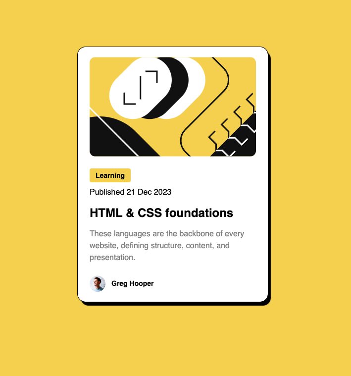

# Frontend Mentor - Blog preview card solution

This is a solution to the [Blog preview card challenge on Frontend Mentor](https://www.frontendmentor.io/challenges/blog-preview-card-ckPaj01IcS). Frontend Mentor challenges help you improve your coding skills by building realistic projects.

## Table of contents

- [Overview](#overview)
  - [The challenge](#the-challenge)
  - [Screenshot](#screenshot)
  - [Links](#links)
- [My process](#my-process)
  - [Built with](#built-with)
  - [What I learned](#what-i-learned)
- [Author](#author)

## Overview

### The challenge

Users should be able to:

- See hover and focus states for all interactive elements on the page

### Screenshot

### Links

- [Frontend Mentor Solution URL](https://www.frontendmentor.io/solutions/blog-preview-card-react-and-tailwind-erNlvXyPem)
- [Live Site URL](https://blog-preview-card-lemon.vercel.app/)

## My process

### Built with

- Semantic HTML5 markup
- [Tailwind CSS](https://tailwindcss.com/) - For styles
- [React](https://reactjs.org/) - JS library

### What I learned

I learned about span elements and how they're inline elements as opposed to block elements. This came into play when I wanted to style a text with a background color without having the color run the entire width of the div.

## Author

- Frontend Mentor - [@justinsane](https://www.frontendmentor.io/profile/justinsane)
- Twitter - [@just_levy](https://www.twitter.com/just_levy)
